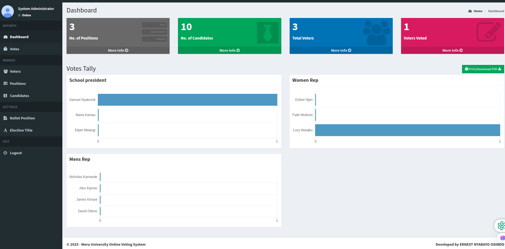

# 🗳️ Online Voting System (Django)

This is a **University Online Voting System** built with Django. It provides a fast, secure, and transparent platform to conduct digital campus elections.

## 🔍 Features

- Voter registration and login
- Role-based access for admins and voters
- Vote casting and live tally visualization
- Admin dashboard to manage:
  - Voters
  - Positions
  - Candidates
- Downloadable PDF reports
- Ballot customization interface

## 📸 Screenshots

### Dashboard  


### Votes Tally  


### Voters List  


### Ballot View  


### Candidate Management  


---

## 🚀 Getting Started

### ✅ Requirements
- Python 3.9+
- pip
- Git

### 🛠 Installation Guide

```bash
# Clone the repository
git clone https://github.com/Nyabayo/OnlineVoting-Django-.git

# Navigate to the project directory
cd OnlineVoting-Django-/OnlineVoting-Django

# Create a virtual environment
python -m venv env
source env/bin/activate  # On Windows: env\Scripts\activate

# Install dependencies
pip install -r requirements.txt

# Apply migrations
python manage.py migrate

# Run the development server
python manage.py runserver
```

Open your browser and visit: [http://127.0.0.1:8000](http://127.0.0.1:8000)

---

## 🖼️ How to Upload Screenshots to GitHub

1. Inside your repo folder, create a directory called `screenshots/`
2. Save your image files (`dashboard.png`, etc.) into that folder
3. Run:

```bash
git add screenshots/
git commit -m "Add screenshots for README"
git push
```

Your README will now display those images hosted from your repo.

---

## 👤 Author

**Ernest Nyabayo Osindo**

- 💼 [LinkedIn Profile](https://www.linkedin.com/in/ernest-osindo-a1b178226/)
- 📧 Email: [ernestosindo9@gmail.com](mailto:ernestosindo9@gmail.com)
- 💬 [Chat on WhatsApp](https://api.whatsapp.com/send?phone=254758087267)

---

## 📜 License

This project is open-source and available under the [MIT License](LICENSE).
